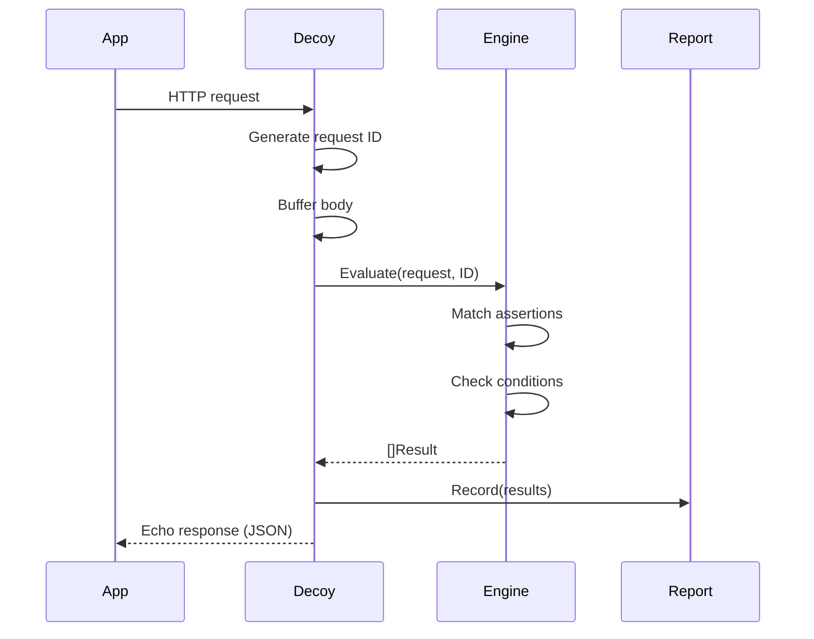
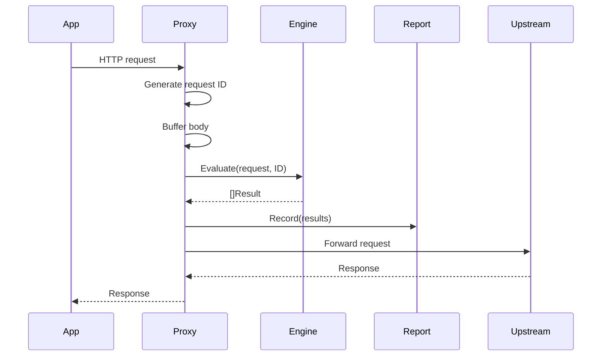

# Architecture

## Package Structure

```
snitchproxy/
├── cmd/snitchproxy/          # CLI entrypoint, flag parsing, wiring
├── internal/
│   ├── assertion/             # Assertion engine: matching, condition evaluation
│   ├── config/                # YAML config parsing, validation, conversion
│   ├── preset/                # Built-in rule packs (pci-dss, aws-keys, etc.)
│   ├── proxy/                 # Transparent proxy mode handler
│   ├── decoy/                 # Decoy endpoint mode handler
│   ├── engine/                # Report accumulation (thread-safe)
│   ├── admin/                 # Admin HTTP API
│   └── report/                # Report formatters (JSON, SARIF, JUnit)
├── pkg/snitchproxy/           # Public Go API for embedding
└── test/integration/          # End-to-end tests
```

## Design Principles

**Hexagonal-ish architecture.** The `engine` package defines ports (interfaces). `proxy`, `decoy`, `report`, and `admin` are adapters. `assertion` and `config` are domain logic.

**Interfaces defined where consumed.** The `decoy` and `proxy` packages each define their own `Evaluator` and `Recorder` interfaces, satisfied by `assertion.Engine` and `engine.Report`.

**No frameworks.** stdlib `net/http` for HTTP, `net/http/httputil` for proxying, `gopkg.in/yaml.v3` for config, `log/slog` for logging.

**No global state.** No `init()` functions, no mutable package-level variables. Everything is wired via dependency injection with functional options.

## Request Flow

### Decoy Mode



### Proxy Mode



## Assertion Evaluation Pipeline

```
Config YAML
    │
    ▼
Load → Validate → Expand presets → Convert → Merge
    │
    ▼
assertion.Engine (immutable after creation)
    │
    ▼
Per-request: Match scope → Evaluate condition → Apply deny/allow → Result
```

1. **Match** — does the request match the assertion's scope (host, path, method, headers)?
2. **Evaluate** — is the condition true (header present, body matches pattern, etc.)?
3. **Invert** — for `deny`, condition true = violation. For `allow`, condition false = violation.

## Severity Levels

| Level | Rank | Typical use |
|-------|------|-------------|
| `critical` | 4 | Credential leaks, PCI violations |
| `high` | 3 | Auth headers to wrong endpoints |
| `warning` | 2 | PII in body, private IPs in headers |
| `info` | 1 | Informational, non-blocking |

The `fail-on` threshold controls the exit code: if any violation meets or exceeds the threshold, the process exits with code 1.
